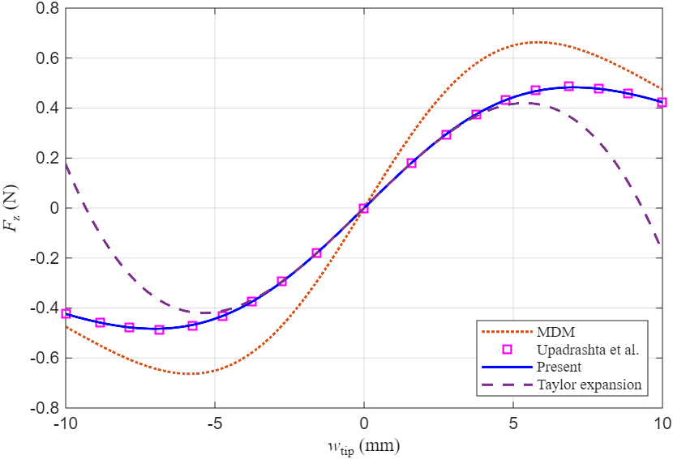
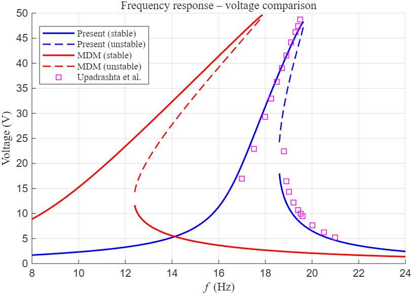

# MMDM
A simple, precise magnetic force formula was proposed by modifying the Magnetic Dipole Method with two correction parameters α and β. It applies to cylindrical and cuboidal magnets in nonlinear piezoelectric energy harvesters, achieving &lt;1% relative error even at small separations while maintaining analytical simplicity for theoretical studies.
# Precise magnetic force model for nonlinear piezoelectric energy harvesting

This repository provides MATLAB code that implements the **highly accurate magnetic force model** proposed in:

> Yang, Y., Xiang, H. (2023). **A simple and precise formula for magnetic forces in nonlinear piezoelectric energy harvesting**. *Nonlinear Dynamics*, 111, 6085–6110.  
> https://doi.org/10.1007/s11071-022-08160-5

The code calculates the voltage frequency response of a monostable piezoelectric energy harvester with magnetic end coupling. It compares the traditional magnetic dipole model (MDM) with the **present model**, demonstrating that the proposed model yields much more accurate results (relative error < 1% in typical cases).

## Results

- **Magnetic force curves** – the corrected model matches theoretical/numerical integration results closely, while the MDM shows significant deviation.
- **Voltage frequency response** – the corrected model accurately predicts the peak voltage and the overall shape of the response, in good agreement with finite element simulations (e.g., ANSYS) and experimental data.

## Run the code

1. Open MATLAB (R2023b or later, with Symbolic Math Toolbox).
2. Run `main.mlx`.
3. The script will generate two key figures:
   - Magnetic force comparison (MDM vs present model vs reference data)
   
   - Voltage frequency response (stable/unstable branches, comparison between MDM and present model)
   

Optional Excel files (`Magnetic force_Upadrashta.xlsx` and `FR_Upadrashta.xlsx`) can be placed in the same folder to plot reference data points.

## Citation

If you use this code, please cite the paper:

```bibtex
@article{yang2023simple,
  title={A simple and precise formula for magnetic forces in nonlinear piezoelectric energy harvesting},
  author={Yang, Yi and Xiang, Hongjun},
  journal={Nonlinear Dynamics},
  volume={111},
  number={7},
  pages={6085--6110},
  year={2023},
  publisher={Springer},
 doi= {10.1007/s11071-022-08160-5}
}
